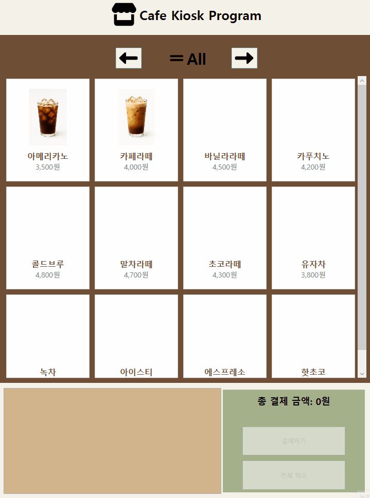
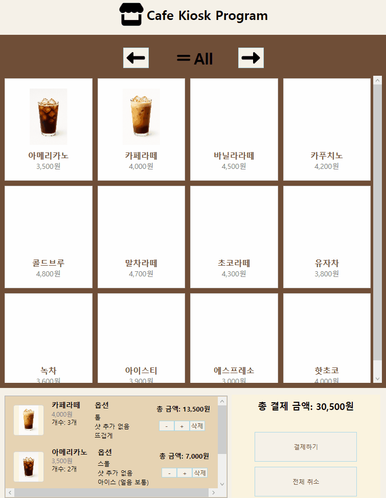

# Cafe_Kiosk

---

wpf로 작성한 카페 키오스크 프로그램입니다.

---

## 프로젝트 개요

- **개발 기간** : 2025.09 ~ 2025.10 (약 1개월)
- **개발환경** : Visual Studio 2022 / .NET 6.0(WPF)
- **사용기술** : C# / XAML
- **개발 형태** : 개인 프로젝트
- **아키텍처 및 디자인 패턴** : MVVM / Repository Pattern / Dependency Injection
- **사용 패키지(NuGet)**
  - FontAwesome6.Svg
  - Microsoft.Extensions.DependencyInjection

---

## 시연 영상

